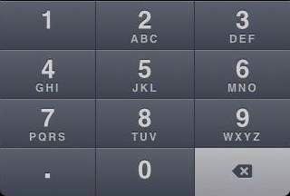

# 如何使用 packed 图片

## 1 介绍

有时我们把多张小图片打包成一张大图片，这种做法在游戏行业和串口屏经常使用。这样做有以下几个原因：

- 美术做图方便。
- 现存的资源就是这样，懒得去切图。
- 在有 GPU 的时候，可以在一定程度提高性能。

最新的 AWTK 对 packed 图片提供了支持。本文介绍一下如何使用 packed 的图片。

## 2 如何指定 packed 图片中的子图

在 style 中指定图片名称时，用#分隔图片名称和子图区域，符号"#"之前是大图片的名称，符号"#"之后是设置子图区域的字符串。指定子图区域的方式有以下几种：

- 空字符串。表示使用控件当前的 xywh 来决定子图的位置和大小。如：

```xml
<pressed bg_image="image_packed_fg#"/>
```

> 注：如果当前控件的区域是 (10, 20, 30, 40)，那么子图的区域也是 (10, 20, 30, 40)。

- g。表示使用控件当前的 xywh 来决定子图的位置和大小，xy 转换成全局坐标。如：

```xml
<pressed bg_image="image_packed_fg#g"/>
```

> 注：如果当前控件的区域是 (10, 20, 30, 40)，相对于窗口的坐标是 50, 60，那么子图的区域就是 (50, 60, 30, 40)。

- xywh(x,y,w,h) 指定子图的绝对坐标。如：

```xml
 <pressed bg_image="image_packed_fg#xywh(106,0,106,54)"/>
```
> 注：那么子图的区域就是 (106,0,106,54) 

- grid(rows,cols,row,col) 将图片划分为 rows 行 cols 列等大小的网格。row 和 col 指定使用哪一格的子图。如：

```xml
<pressed bg_image="image_packed_fg#grid(4,3,0,2)"/
```

> 注：如果图片大小是 80x60，那么子图的区域就是 (40,0,20,20) 

## 3 示例

此处准备两张packed图片，正常时的效果图片名称为image_packed_bg，颜色浅一点；按下时的效果图片名称为image_packed_fg，颜色深一点。

- 正常时的效果


- 按下时的效果



> 注：两张图看起来有些相近，第二张是把第一张调暗后得到的，不过运行起来后按下效果很明显的。

### 3.1 UI 文件

```xml
<window>
  <view style="image_packed" x="c" y="m" w="320" h="216" children_layout="default(r=4,c=3)">
    <button style="num_1"/>
    <button style="num_2"/>
    <button style="num_3"/>
    <button style="num_4"/>
    <button style="num_5"/>
    <button style="num_6"/>
    <button style="num_7"/>
    <button style="num_8"/>
    <button style="num_9"/>
    <button style="dot"/>
    <button style="num_0"/>
    <button style="backspace"/>
  </view>
</window>
```

### 3.2 Style 文件

- 使用第一张图为 view 的背景图。按钮在正常情况什么都不用显示。
- 按钮在 pressed 状态下背景用指定区域的图片。
- 本例子演示来各种用法。通常使用缺省用法即可：

```xml
<pressed bg_image="image_packed_fg#" />
```

```xml
<button>
	<style name="num_1">
		<normal />
		<pressed bg_image="image_packed_fg#xywh(0,0,106,54)" />
	</style>
	<style name="num_2">
		<normal />
		<pressed bg_image="image_packed_fg#xywh(106,0,106,54)" />
	</style>
	<style name="num_3">
		<normal />
		<pressed bg_image="image_packed_fg#grid(4,3,0,2)" />
	</style>
	<style name="num_4">
		<normal />
		<pressed bg_image="image_packed_fg#grid(4,3,1,0)" />
	</style>
	<style name="num_5">
		<normal />
		<pressed bg_image="image_packed_fg#grid(4,3,1,1)" />
	</style>
	<style name="num_6">
		<normal />
		<pressed bg_image="image_packed_fg#grid(4,3,1,2)" />
	</style>
	<style name="num_7">
		<normal />
		<pressed bg_image="image_packed_fg#grid(4,3,2,0)" />
	</style>
	<style name="num_8">
		<normal />
		<pressed bg_image="image_packed_fg#grid(4,3,2,1)" />
	</style>
	<style name="num_9">
		<normal />
		<pressed bg_image="image_packed_fg#grid(4,3,2,2)" />
	</style>
	<style name="dot">
		<normal />
		<pressed bg_image="image_packed_fg#" />
	</style>
	<style name="num_0">
		<normal />
		<pressed bg_image="image_packed_fg#" />
	</style>
	<style name="backspace">
		<normal />
		<pressed bg_image="image_packed_fg#" />
	</style>
</button>
<view>
	<style name="image_packed">
		<normal bg_image="image_packed_bg" />
	</style>
</view>
```

### 3.3 运行例程

```bash
./bin/preview_ui ui=design/default/ui/image_packed.xml
```

## 4. 限制

- 目前只能在 style 中使用。
- draw\_type 只支持 default|scale|center|icon 等几种。
