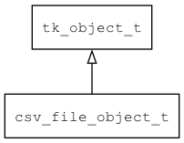

## csv\_file\_object\_t
### 概述


将cvs file包装成object对象。

示例

```c
char filename[MAX_PATH + 1] = {0};
path_prepend_temp_path(filename, "test.csv");

const char *csv_data1 = "name,age,weight\n"
"awplc,18,60.5\n";
ENSURE(file_write(filename, csv_data1, strlen(csv_data1)) == RET_OK);

// 从文件加载
tk_object_t *csv = csv_file_object_load(filename, ',');

// 获取数据: 通过属性名
ENSURE(tk_str_eq(tk_object_get_prop_str(csv, "[1].name"), "awplc"));
ENSURE(tk_object_get_prop_int(csv, "[1].age", 0) == 18);
ENSURE(tk_object_get_prop_double(csv, "[1].weight", 0) == 60.5);

// 获取数据: 通过属性索引
ENSURE(tk_str_eq(tk_object_get_prop_str(csv, "[1].0"), "awplc"));
ENSURE(tk_object_get_prop_int(csv, "[1].1", 0) == 18);
ENSURE(tk_object_get_prop_double(csv, "[1].2", 0) == 60.5);

// 销毁对象
TK_OBJECT_UNREF(csv);

// 从内存加载
csv = csv_file_object_load_from_buff(csv_data1, strlen(csv_data1), ',');

// 获取数据: 通过属性名
ENSURE(tk_str_eq(tk_object_get_prop_str(csv, "[1].name"), "awplc"));
ENSURE(tk_object_get_prop_int(csv, "[1].age", 0) == 18);
ENSURE(tk_object_get_prop_double(csv, "[1].weight", 0) == 60.5);

// 获取数据: 通过属性索引
ENSURE(tk_str_eq(tk_object_get_prop_str(csv, "[1].0"), "awplc"));
ENSURE(tk_object_get_prop_int(csv, "[1].1", 0) == 18);
ENSURE(tk_object_get_prop_double(csv, "[1].2", 0) == 60.5);

// 设置数据
ENSURE(tk_object_set_prop_int(csv, "[1].age", 20) == RET_OK);
ENSURE(tk_object_get_prop_int(csv, "[1].age", 0) == 20);

// 保存到文件
ENSURE(csv_file_object_save_as(csv, filename) == RET_OK);
ENSURE(file_exist(filename) == TRUE);

// 销毁对象
TK_OBJECT_UNREF(csv);
```
----------------------------------
### 函数
<p id="csv_file_object_t_methods">

| 函数名称 | 说明 | 
| -------- | ------------ | 
| <a href="#csv_file_object_t_csv_file_object_cast">csv\_file\_object\_cast</a> | 转换为csv_file_object_t。 |
| <a href="#csv_file_object_t_csv_file_object_create">csv\_file\_object\_create</a> | 将csv_file对象包装成object。 |
| <a href="#csv_file_object_t_csv_file_object_find_first">csv\_file\_object\_find\_first</a> | 查找第一个满足条件的行。 |
| <a href="#csv_file_object_t_csv_file_object_get_csv">csv\_file\_object\_get\_csv</a> | 获取csv对象。 |
| <a href="#csv_file_object_t_csv_file_object_load">csv\_file\_object\_load</a> | 从指定文件加载CSV对象。 |
| <a href="#csv_file_object_t_csv_file_object_load_from_buff">csv\_file\_object\_load\_from\_buff</a> | 从内存加载CSV对象。 |
| <a href="#csv_file_object_t_csv_file_object_parse_col">csv\_file\_object\_parse\_col</a> | 解析列名。 |
| <a href="#csv_file_object_t_csv_file_object_save_as">csv\_file\_object\_save\_as</a> | 将doc对象保存到指定文件。 |
| <a href="#csv_file_object_t_csv_file_object_save_to_buff">csv\_file\_object\_save\_to\_buff</a> | 将obj保存为CSV格式到内存。 |
| <a href="#csv_file_object_t_csv_file_object_set_check_new_row">csv\_file\_object\_set\_check\_new\_row</a> | 设置检查新行的回调。 |
| <a href="#csv_file_object_t_csv_file_object_set_filter">csv\_file\_object\_set\_filter</a> | 设置过滤器。 |
#### csv\_file\_object\_cast 函数
-----------------------

* 函数功能：

> <p id="csv_file_object_t_csv_file_object_cast">转换为csv_file_object_t。

* 函数原型：

```
csv_file_object_t* csv_file_object_cast (tk_object_t* obj);
```

* 参数说明：

| 参数 | 类型 | 说明 |
| -------- | ----- | --------- |
| 返回值 | csv\_file\_object\_t* | 返回csv\_file\_object\_t对象。 |
| obj | tk\_object\_t* | doc对象。 |
#### csv\_file\_object\_create 函数
-----------------------

* 函数功能：

> <p id="csv_file_object_t_csv_file_object_create">将csv_file对象包装成object。

* 函数原型：

```
tk_object_t* csv_file_object_create (csv_file_t* csv);
```

* 参数说明：

| 参数 | 类型 | 说明 |
| -------- | ----- | --------- |
| 返回值 | tk\_object\_t* | 返回对象。 |
| csv | csv\_file\_t* | csv对象(由object释放)。 |
#### csv\_file\_object\_find\_first 函数
-----------------------

* 函数功能：

> <p id="csv_file_object_t_csv_file_object_find_first">查找第一个满足条件的行。

* 函数原型：

```
csv_row_t* csv_file_object_find_first (tk_object_t* obj, tk_compare_t compare, void* ctx);
```

* 参数说明：

| 参数 | 类型 | 说明 |
| -------- | ----- | --------- |
| 返回值 | csv\_row\_t* | 返回行对象。 |
| obj | tk\_object\_t* | doc对象。 |
| compare | tk\_compare\_t | 比较函数。 |
| ctx | void* | 上下文。 |
#### csv\_file\_object\_get\_csv 函数
-----------------------

* 函数功能：

> <p id="csv_file_object_t_csv_file_object_get_csv">获取csv对象。

* 函数原型：

```
csv_file_t* csv_file_object_get_csv (tk_object_t* obj);
```

* 参数说明：

| 参数 | 类型 | 说明 |
| -------- | ----- | --------- |
| 返回值 | csv\_file\_t* | 返回csv对象。 |
| obj | tk\_object\_t* | obj对象。 |
#### csv\_file\_object\_load 函数
-----------------------

* 函数功能：

> <p id="csv_file_object_t_csv_file_object_load">从指定文件加载CSV对象。

* 函数原型：

```
tk_object_t* csv_file_object_load (const char* filename, char sep);
```

* 参数说明：

| 参数 | 类型 | 说明 |
| -------- | ----- | --------- |
| 返回值 | tk\_object\_t* | 返回配置对象。 |
| filename | const char* | 文件名。 |
| sep | char | 分隔符。 |
#### csv\_file\_object\_load\_from\_buff 函数
-----------------------

* 函数功能：

> <p id="csv_file_object_t_csv_file_object_load_from_buff">从内存加载CSV对象。

* 函数原型：

```
tk_object_t* csv_file_object_load_from_buff (const void* buff, uint32_t size, char sep);
```

* 参数说明：

| 参数 | 类型 | 说明 |
| -------- | ----- | --------- |
| 返回值 | tk\_object\_t* | 返回配置对象。 |
| buff | const void* | 数据。 |
| size | uint32\_t | 数据长度。 |
| sep | char | 分隔符。 |
#### csv\_file\_object\_parse\_col 函数
-----------------------

* 函数功能：

> <p id="csv_file_object_t_csv_file_object_parse_col">解析列名。

* 函数原型：

```
int32_t csv_file_object_parse_col (csv_file_object_t* o, const char* name);
```

* 参数说明：

| 参数 | 类型 | 说明 |
| -------- | ----- | --------- |
| 返回值 | int32\_t | 返回列索引。 |
| o | csv\_file\_object\_t* | csv\_file\_object\_t对象。 |
| name | const char* | 列名。 |
#### csv\_file\_object\_save\_as 函数
-----------------------

* 函数功能：

> <p id="csv_file_object_t_csv_file_object_save_as">将doc对象保存到指定文件。

* 函数原型：

```
ret_t csv_file_object_save_as (tk_object_t* obj, const char* filename);
```

* 参数说明：

| 参数 | 类型 | 说明 |
| -------- | ----- | --------- |
| 返回值 | ret\_t | 返回RET\_OK表示成功，否则表示失败 |
| obj | tk\_object\_t* | doc对象。 |
| filename | const char* | 文件名。 |
#### csv\_file\_object\_save\_to\_buff 函数
-----------------------

* 函数功能：

> <p id="csv_file_object_t_csv_file_object_save_to_buff">将obj保存为CSV格式到内存。

* 函数原型：

```
ret_t csv_file_object_save_to_buff (tk_object_t* obj, wbuffer_t* wb);
```

* 参数说明：

| 参数 | 类型 | 说明 |
| -------- | ----- | --------- |
| 返回值 | ret\_t | 返回RET\_OK表示成功，否则表示失败 |
| obj | tk\_object\_t* | doc对象。 |
| wb | wbuffer\_t* | 返回结果(不要初始化，使用完成后要调用wbuffer\_deinit)。 |
#### csv\_file\_object\_set\_check\_new\_row 函数
-----------------------

* 函数功能：

> <p id="csv_file_object_t_csv_file_object_set_check_new_row">设置检查新行的回调。

* 函数原型：

```
ret_t csv_file_object_set_check_new_row (tk_object_t* obj, csv_filter_object_check_new_row_t check_new_row, void* ctx);
```

* 参数说明：

| 参数 | 类型 | 说明 |
| -------- | ----- | --------- |
| 返回值 | ret\_t | 返回RET\_OK表示成功，否则表示失败 |
| obj | tk\_object\_t* | doc对象。 |
| check\_new\_row | csv\_filter\_object\_check\_new\_row\_t | 检查新行的回调。 |
| ctx | void* | 上下文。 |
#### csv\_file\_object\_set\_filter 函数
-----------------------

* 函数功能：

> <p id="csv_file_object_t_csv_file_object_set_filter">设置过滤器。

* 函数原型：

```
ret_t csv_file_object_set_filter (tk_object_t* obj, csv_file_object_filter_t filter, void* ctx);
```

* 参数说明：

| 参数 | 类型 | 说明 |
| -------- | ----- | --------- |
| 返回值 | ret\_t | 返回RET\_OK表示成功，否则表示失败 |
| obj | tk\_object\_t* | doc对象。 |
| filter | csv\_file\_object\_filter\_t | 过滤器。 |
| ctx | void* | 上下文。 |
