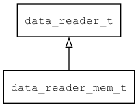

## data\_reader\_mem\_t
### 概述


基于内存实现的 data_reader。通过 data_reader_factory 创建 reader 时，URL的格式如下(请用函数data_reader_mem_build_url生成)：

```
mem://addr:size
```
----------------------------------
### 函数
<p id="data_reader_mem_t_methods">

| 函数名称 | 说明 | 
| -------- | ------------ | 
| <a href="#data_reader_mem_t_data_reader_mem_build_url">data\_reader\_mem\_build\_url</a> | 构造内存URL。 |
| <a href="#data_reader_mem_t_data_reader_mem_create">data\_reader\_mem\_create</a> | 创建基于内存的 data reader。 |
#### data\_reader\_mem\_build\_url 函数
-----------------------

* 函数功能：

> <p id="data_reader_mem_t_data_reader_mem_build_url">构造内存URL。

* 函数原型：

```
const char* data_reader_mem_build_url (const void* mem, uint32_t size, char* url);
```

* 参数说明：

| 参数 | 类型 | 说明 |
| -------- | ----- | --------- |
| 返回值 | const char* | 返回URL。 |
| mem | const void* | 内存的地址。 |
| size | uint32\_t | 内存的长度。 |
| url | char* | 生成的URL。 |
#### data\_reader\_mem\_create 函数
-----------------------

* 函数功能：

> <p id="data_reader_mem_t_data_reader_mem_create">创建基于内存的 data reader。

> 不要直接调用，而是注册到 data\_reader\_factory后，通过data\_reader\_factory调用。

* 函数原型：

```
data_reader_t* data_reader_mem_create (const char* memname);
```

* 参数说明：

| 参数 | 类型 | 说明 |
| -------- | ----- | --------- |
| 返回值 | data\_reader\_t* | 返回data reader对象。 |
| memname | const char* | 内存地址和大小的字符串格式表示 。 |
