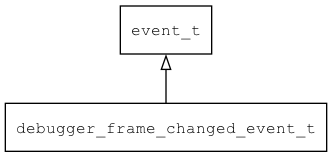

## debugger\_frame\_changed\_event\_t
### 概述


用户切换到调用堆栈指定的frame的事件。
----------------------------------
### 函数
<p id="debugger_frame_changed_event_t_methods">

| 函数名称 | 说明 | 
| -------- | ------------ | 
| <a href="#debugger_frame_changed_event_t_debugger_frame_changed_event_cast">debugger\_frame\_changed\_event\_cast</a> | 把event对象转debugger_frame_changed_event_t对象。 |
| <a href="#debugger_frame_changed_event_t_debugger_frame_changed_event_init">debugger\_frame\_changed\_event\_init</a> | 初始化 |
| <a href="#debugger_frame_changed_event_t_debugger_frame_changed_event_init_ex">debugger\_frame\_changed\_event\_init\_ex</a> | 初始化 |
### 属性
<p id="debugger_frame_changed_event_t_properties">

| 属性名称 | 类型 | 说明 | 
| -------- | ----- | ------------ | 
| <a href="#debugger_frame_changed_event_t_file_path">file\_path</a> | const char* | 文件路径。（备注：可能文件路径为空） |
| <a href="#debugger_frame_changed_event_t_func">func</a> | const char* | 函数名。 |
| <a href="#debugger_frame_changed_event_t_line">line</a> | uint32\_t | 行号。 |
#### debugger\_frame\_changed\_event\_cast 函数
-----------------------

* 函数功能：

> <p id="debugger_frame_changed_event_t_debugger_frame_changed_event_cast">把event对象转debugger_frame_changed_event_t对象。

* 函数原型：

```
debugger_frame_changed_event_t* debugger_frame_changed_event_cast (event_t* event);
```

* 参数说明：

| 参数 | 类型 | 说明 |
| -------- | ----- | --------- |
| 返回值 | debugger\_frame\_changed\_event\_t* | 返回event对象。 |
| event | event\_t* | event对象。 |
#### debugger\_frame\_changed\_event\_init 函数
-----------------------

* 函数功能：

> <p id="debugger_frame_changed_event_t_debugger_frame_changed_event_init">初始化

* 函数原型：

```
event_t* debugger_frame_changed_event_init (debugger_frame_changed_event_t* event, const char* func, uint32_t line);
```

* 参数说明：

| 参数 | 类型 | 说明 |
| -------- | ----- | --------- |
| 返回值 | event\_t* | 返回event对象。 |
| event | debugger\_frame\_changed\_event\_t* | event对象。 |
| func | const char* | 函数名。 |
| line | uint32\_t | 行号。 |
#### debugger\_frame\_changed\_event\_init\_ex 函数
-----------------------

* 函数功能：

> <p id="debugger_frame_changed_event_t_debugger_frame_changed_event_init_ex">初始化

* 函数原型：

```
event_t* debugger_frame_changed_event_init_ex (debugger_frame_changed_event_t* event, const char* func, uint32_t line, const char* file_path);
```

* 参数说明：

| 参数 | 类型 | 说明 |
| -------- | ----- | --------- |
| 返回值 | event\_t* | 返回event对象。 |
| event | debugger\_frame\_changed\_event\_t* | event对象。 |
| func | const char* | 函数名。 |
| line | uint32\_t | 行号。 |
| file\_path | const char* | 文件路径。 |
#### file\_path 属性
-----------------------
> <p id="debugger_frame_changed_event_t_file_path">文件路径。（备注：可能文件路径为空）

* 类型：const char*

| 特性 | 是否支持 |
| -------- | ----- |
| 可直接读取 | 是 |
| 可直接修改 | 否 |
#### func 属性
-----------------------
> <p id="debugger_frame_changed_event_t_func">函数名。

* 类型：const char*

| 特性 | 是否支持 |
| -------- | ----- |
| 可直接读取 | 是 |
| 可直接修改 | 否 |
#### line 属性
-----------------------
> <p id="debugger_frame_changed_event_t_line">行号。

* 类型：uint32\_t

| 特性 | 是否支持 |
| -------- | ----- |
| 可直接读取 | 是 |
| 可直接修改 | 否 |
