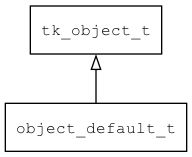

## object\_default\_t
### 概述


对象接口的缺省实现。

通用当作 map 数据结构使用，内部用有序数组保存所有属性，因此可以快速查找指定名称的属性。

示例

```c
// 创建默认对象
tk_object_t *obj = object_default_create();

// 设置属性
tk_object_set_prop_str(obj, "name", "awplc");
tk_object_set_prop_int(obj, "age", 18);
tk_object_set_prop_double(obj, "weight", 60.5);

// 获取属性
ENSURE(tk_str_eq(tk_object_get_prop_str(obj, "name"), "awplc"));
ENSURE(tk_object_get_prop_int(obj, "age", 0) == 18);
ENSURE(tk_object_get_prop_double(obj, "weight", 0) == 60.5);

// 遍历属性
tk_object_foreach_prop(obj, visit_obj, NULL);

// 释放对象
TK_OBJECT_UNREF(obj);
```
----------------------------------
### 函数
<p id="object_default_t_methods">

| 函数名称 | 说明 | 
| -------- | ------------ | 
| <a href="#object_default_t_object_default_cast">object\_default\_cast</a> | 转换为object_default对象。 |
| <a href="#object_default_t_object_default_clear_props">object\_default\_clear\_props</a> | 清除全部属性。 |
| <a href="#object_default_t_object_default_clone">object\_default\_clone</a> | 克隆对象。 |
| <a href="#object_default_t_object_default_create">object\_default\_create</a> | 创建对象。 |
| <a href="#object_default_t_object_default_create_ex">object\_default\_create\_ex</a> | 创建对象。 |
| <a href="#object_default_t_object_default_find_prop">object\_default\_find\_prop</a> | 查找满足条件的属性，并返回它的值。 |
| <a href="#object_default_t_object_default_set_keep_prop_type">object\_default\_set\_keep\_prop\_type</a> | 设置属性值时不改变属性的类型。 |
| <a href="#object_default_t_object_default_unref">object\_default\_unref</a> | for script gc |
#### object\_default\_cast 函数
-----------------------

* 函数功能：

> <p id="object_default_t_object_default_cast">转换为object_default对象。

* 函数原型：

```
object_default_t* object_default_cast (tk_object_t* obj);
```

* 参数说明：

| 参数 | 类型 | 说明 |
| -------- | ----- | --------- |
| 返回值 | object\_default\_t* | object\_default对象。 |
| obj | tk\_object\_t* | object\_default对象。 |
#### object\_default\_clear\_props 函数
-----------------------

* 函数功能：

> <p id="object_default_t_object_default_clear_props">清除全部属性。

* 函数原型：

```
ret_t object_default_clear_props (tk_object_t* obj);
```

* 参数说明：

| 参数 | 类型 | 说明 |
| -------- | ----- | --------- |
| 返回值 | ret\_t | 返回RET\_OK表示成功，否则表示失败。 |
| obj | tk\_object\_t* | 对象。 |
#### object\_default\_clone 函数
-----------------------

* 函数功能：

> <p id="object_default_t_object_default_clone">克隆对象。

* 函数原型：

```
tk_object_t* object_default_clone (object_default_t* o);
```

* 参数说明：

| 参数 | 类型 | 说明 |
| -------- | ----- | --------- |
| 返回值 | tk\_object\_t* | 返回object对象。 |
| o | object\_default\_t* | 被克隆的对象。 |
#### object\_default\_create 函数
-----------------------

* 函数功能：

> <p id="object_default_t_object_default_create">创建对象。

* 函数原型：

```
tk_object_t* object_default_create ();
```

* 参数说明：

| 参数 | 类型 | 说明 |
| -------- | ----- | --------- |
| 返回值 | tk\_object\_t* | 返回object对象。 |
#### object\_default\_create\_ex 函数
-----------------------

* 函数功能：

> <p id="object_default_t_object_default_create_ex">创建对象。

* 函数原型：

```
tk_object_t* object_default_create_ex (bool_t enable_path);
```

* 参数说明：

| 参数 | 类型 | 说明 |
| -------- | ----- | --------- |
| 返回值 | tk\_object\_t* | 返回object对象。 |
| enable\_path | bool\_t | 是否支持按路径访问属性。 |
#### object\_default\_find\_prop 函数
-----------------------

* 函数功能：

> <p id="object_default_t_object_default_find_prop">查找满足条件的属性，并返回它的值。

* 函数原型：

```
value_t* object_default_find_prop (tk_object_t* obj, tk_compare_t cmp, const void* data);
```

* 参数说明：

| 参数 | 类型 | 说明 |
| -------- | ----- | --------- |
| 返回值 | value\_t* | 返回属性的值。 |
| obj | tk\_object\_t* | 对象。 |
| cmp | tk\_compare\_t | 比较函数。 |
| data | const void* | 要比较的数据。 |
#### object\_default\_set\_keep\_prop\_type 函数
-----------------------

* 函数功能：

> <p id="object_default_t_object_default_set_keep_prop_type">设置属性值时不改变属性的类型。

* 函数原型：

```
ret_t object_default_set_keep_prop_type (tk_object_t* obj, bool_t keep_prop_type);
```

* 参数说明：

| 参数 | 类型 | 说明 |
| -------- | ----- | --------- |
| 返回值 | ret\_t | 返回RET\_OK表示成功，否则表示失败。 |
| obj | tk\_object\_t* | 对象。 |
| keep\_prop\_type | bool\_t | 不改变属性的类型。 |
#### object\_default\_unref 函数
-----------------------

* 函数功能：

> <p id="object_default_t_object_default_unref">for script gc

* 函数原型：

```
ret_t object_default_unref (tk_object_t* obj);
```

* 参数说明：

| 参数 | 类型 | 说明 |
| -------- | ----- | --------- |
| 返回值 | ret\_t | 返回RET\_OK表示成功，否则表示失败。 |
| obj | tk\_object\_t* | 对象。 |
