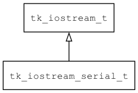

## tk\_iostream\_serial\_t
### 概述


基于串口实现的输入输出流。
备注：如果需要在 Windows 平台运行，请在应用程序初始化时，调用 tk_socket_init 函数初始化 socket。
----------------------------------
### 函数
<p id="tk_iostream_serial_t_methods">

| 函数名称 | 说明 | 
| -------- | ------------ | 
| <a href="#tk_iostream_serial_t_tk_iostream_serial_config">tk\_iostream\_serial\_config</a> | 配置串口。 |
| <a href="#tk_iostream_serial_t_tk_iostream_serial_create">tk\_iostream\_serial\_create</a> | 创建串口iostream对象。 |
| <a href="#tk_iostream_serial_t_tk_iostream_serial_create_ex">tk\_iostream\_serial\_create\_ex</a> | 创建串口iostream对象。 |
| <a href="#tk_iostream_serial_t_tk_iostream_serial_wait_for_data">tk\_iostream\_serial\_wait\_for\_data</a> | 等待串口数据。 |
#### tk\_iostream\_serial\_config 函数
-----------------------

* 函数功能：

> <p id="tk_iostream_serial_t_tk_iostream_serial_config">配置串口。
备注：如果需要在 Windows 平台运行，请在应用程序初始化时，调用 tk_socket_init 函数初始化 socket。

* 函数原型：

```
ret_t tk_iostream_serial_config (tk_iostream_t* iostream, int32_t baudrate, bytesize_t bytesize, parity_t parity, stopbits_t stopbits, flowcontrol_t flowcontrol);
```

* 参数说明：

| 参数 | 类型 | 说明 |
| -------- | ----- | --------- |
| 返回值 | ret\_t | 返回RET\_OK表示成功，否则表示失败。 |
| iostream | tk\_iostream\_t* | 串口对象。 |
| baudrate | int32\_t | 波特率。 |
| bytesize | bytesize\_t | 字节位数。 |
| parity | parity\_t | 奇偶校验。 |
| stopbits | stopbits\_t | 停止位。 |
| flowcontrol | flowcontrol\_t | 流控。 |
#### tk\_iostream\_serial\_create 函数
-----------------------

* 函数功能：

> <p id="tk_iostream_serial_t_tk_iostream_serial_create">创建串口iostream对象。
> 缺省配置: baudrate=115200 bytesize=8 stopbits=1 flowcontrol=0 parity=0

* 函数原型：

```
tk_iostream_t* tk_iostream_serial_create (const char* port);
```

* 参数说明：

| 参数 | 类型 | 说明 |
| -------- | ----- | --------- |
| 返回值 | tk\_iostream\_t* | 返回iostream对象。 |
| port | const char* | port name。 |
#### tk\_iostream\_serial\_create\_ex 函数
-----------------------

* 函数功能：

> <p id="tk_iostream_serial_t_tk_iostream_serial_create_ex">创建串口iostream对象。
* serial    : serial://device?baudrate=115200&stopbits=1
* serial    : serial://device?baudrate=115200&stopbits=1&parity=odd&flowcontrol=soft&bytesize=8

串口URL参数说明：
* baudrate {int} 波特率。常用值： 9600, 38400, 57600, 115200。(默认值：115200)
* stopbits {string} 停止位。可选值：1, 1.5, 2。(默认值：1)
* parity {string} 校验位。可选值：none, odd, even, mark, space。(默认值：none)
* flowcontrol {string} 流控。可选值：none, hardware, software。(默认值：none)
* bytesize {string} 数据位。可选值：5, 6, 7, 8 。(默认值：8)

* 函数原型：

```
tk_iostream_t* tk_iostream_serial_create_ex (const char* url);
```

* 参数说明：

| 参数 | 类型 | 说明 |
| -------- | ----- | --------- |
| 返回值 | tk\_iostream\_t* | 返回iostream对象。 |
| url | const char* | 串口设备文件及参数。 |
#### tk\_iostream\_serial\_wait\_for\_data 函数
-----------------------

* 函数功能：

> <p id="tk_iostream_serial_t_tk_iostream_serial_wait_for_data">等待串口数据。

* 函数原型：

```
ret_t tk_iostream_serial_wait_for_data (tk_iostream_t* iostream, uint32_t timeout);
```

* 参数说明：

| 参数 | 类型 | 说明 |
| -------- | ----- | --------- |
| 返回值 | ret\_t | 返回RET\_OK表示成功，否则表示失败。 |
| iostream | tk\_iostream\_t* | 串口对象。 |
| timeout | uint32\_t | 等待时间(ms)。 |
